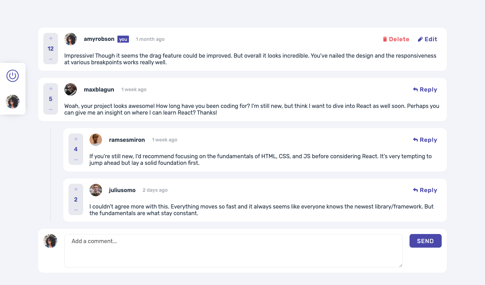
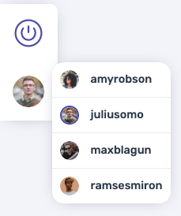
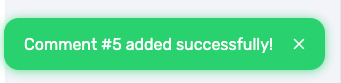
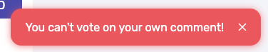

# Frontend Mentor - Interactive comments section solution

This is a solution to the [Interactive comments section challenge on Frontend Mentor](https://www.frontendmentor.io/challenges/interactive-comments-section-iG1RugEG9). Frontend Mentor challenges help you improve your coding skills by building realistic projects.

## Table of contents

- [Overview](#overview)
  - [The challenge](#the-challenge)
  - [Bonus features](#bonus-features)
  - [Links](#links)
- [My process](#my-process)
  - [Built with](#built-with)
  - [What I'm proud & What I learned](#what-im-proud--what-i-learned)
    - [A better use for SASS/SCSS](#a-better-use-for-sassscss)
    - [Use of slots to avoid repeating tons of code](#use-of-slots-to-avoid-repeating-tons-of-code)
    - [Effective use of Grid layout for responsiveness](#effective-use-of-grid-layout-for-responsiveness)
    - [Implementation and use of some smaller feats](#implementation-and-use-of-some-smaller-feats)
    - [The "Backend"](#the-backend)
  - [Continued development](#continued-development)
  - [Useful resources](#useful-resources)
- [Author](#author)
- [Acknowledgments](#acknowledgments)

**Note: Delete this note and update the table of contents based on what sections you keep.**

## Overview



### The challenge

Users should be able to:

- :white_check_mark: View the optimal layout for the app depending on their device's screen size
- :white_check_mark: See hover states for all interactive elements on the page
- :white_check_mark: Create, Read, Update, and Delete comments and replies
- :white_check_mark: Upvote and downvote comments
- :white_check_mark: **Bonus**: If you're building a purely front-end project, use `localStorage` to save the current state in the browser that persists when the browser is refreshed.
- :white_check_mark: **Bonus**: Instead of using the `createdAt` strings from the `data.json` file, try using timestamps and dynamically track the time since the comment or reply was posted.

### Bonus Features
#### Controller for testing



To make the tests more easier, I added a component `TestingControls`, which you can use to:
- Reset the comments list to the initial (provided by Frontend Mentor in project files)
- Alter the current "logged" (active) user who perform the actions

These actions comes in handy to test (or just play with the solution) in various ways.

#### Toasts for visual feedback




After performing actions like submitting new comment, editing, deleting or voting, we need to know if the action was executed or if some kind of error happened. The toasts were implemented and added to give us these feedbacks!


### Links

- Solution URL: [Add solution URL here](https://your-solution-url.com)
- Live Site URL: [Link](https://fem-comments-section-ryc.netlify.app/)
- Repository: [Link](https://github.com/ricardoychino/fem-comments-section-component)

## My process

### Built with

- TypeScript
- SCSS
- Flexbox + Grid
- Mobile-first workflow
- [Vue 3](https://vuejs.org/) w/ Composition API
- [Vue Transitions](https://vuejs.org/guide/built-ins/transition.html#transition)
- Pinia


## WHAT I'M PROUD & WHAT I LEARNED

### A better use for SASS/SCSS

There are two main features that I'm proud of the use of SASS/SCSS in this project:

1. The use of mixins and variables to create themes for buttons. In other projects, I created similar variety of button styles and themes, but it was pretty convoluted and verbous. The use of mixins made it more simple to add new themes without the need to repeat too much code

```css
/* variables.scss */
$theme-colors: (
  "neutral": $neutral-700,
  "primary": $color-primary,
  "primary-inverse": $color-primary-soft,
  "danger": $color-danger,
  "success": $color-success,
);
$theme-colors-soft: (
  "neutral": $neutral-400,
  "primary": $color-primary-soft,
  "primary-inverse": $color-primary,
  "danger": $color-danger-soft,
  "success": $color-success-soft
);

/* Mixin for buttons */
@mixin btn-theme($color: "neutral") {
  color: $neutral-000;
  background-color: map.get($theme-colors, $color);

  svg {
    fill: $neutral-000;
  }

  &:hover {
    background-color: map.get($theme-colors-soft, $color)
  }

  &.flat-btn {
    color: map.get($theme-colors, $color);
    background-color: transparent;
    text-transform: unset;
    font-weight: 500;
    padding: 5px 10px;

    svg {
      fill: map.get($theme-colors, $color);
    }

    &:hover {
      // background-color: #{$color}33;
      color: map.get($theme-colors-soft, $color);

      svg {
        fill: map.get($theme-colors-soft, $color);
      }
    }
  }
}

/* To declare a theme */
button.success {
  @include btn-theme($color: "success");
}

```

2. Another use of Mixins that I never tought of before is to declare the Vue transition's CSS classes. Usually I just code them once in projects so I didn't mind, but it is quite a chunk of code to write. To simplify it a little, created the mixin:

```css
@mixin vue-transition($name) {

  .#{$name} {
    /*
      Use with this format:

      @include vue-transition('name') {
        &__active { ... }         // CSS for when visible
        &__inactive { ... }       // CSS for when hidden
        &__transition-in { ... }  // CSS transition when becoming visible
        &__transition-out { ... } // CSS transition when becoming hidden
      }
    */
    @content;

    &-enter {
      &-from {
        @extend .#{$name}__inactive;
      }
      &-active {
        @extend .#{$name}__transition-in;
      }
      &-to {
        @extend .#{$name}__active;
      }
    }
    &-leave {
      &-from {
        @extend .#{$name}__active;
      }
      &-active {
        @extend .#{$name}__transition-out;
      }
      &-to {
        @extend .#{$name}__inactive;
      }
    }
  }
}
```

and then we just need to declare, such as:


```css
@include vue-transition('modal') {
  &__active {
    opacity: 1;
  }
  &__inactive {
    opacity: 0;

    .modal-dialog {
      transform: translateY(-40px);
    }
  }
  &__transition-in,
  &__transition-out {
    transition: all 0.2s linear;
  }
}
```

Maybe not the prettiest, but avoided A LOT of repetition on this solution.

### Use of `slots` to avoid repeating tons of code

Created some layout components, such as `ModalBase`, `CommentItemLayout` and `ButtonWithLoading`.

`ModalBase` is used just once, in the Modal to delete comment, but writing it as a template prepares for *possible* future modal implementations.

`CommentItemLayout` have only two uses, one with empty/deleted comment, and another with the usual ones. But the idea here is to avoid writing tons of `v-if/v-else` and keep the code a little bit cleaner.

`ButtonWithLoading` just saved me from writing the loading component and the `v-show` tons of times.


### Effective use of Grid layout for responsiveness

I never used Grid layout in any project before. I usually go with the flexbox. And to tell the truth, I started doing the changes for desktop and mobile layouts changing the properties `order` according to the viewport size, but I realized that it is an ugly code, and the use of `grid-template-areas` and `grid-area` would be so much better. And it paid off. Much more succint and efficient way to handle the design positioning changes.

### Implementation and use of some "smaller" feats

There are some small details or invisible features that improves the overall experience or the performance of the application.

- Dynamic load of SVG icons, in a single component. Credits to [this solution][1]

- Textarea with auto-height (Credits to Vue core team)

- Toasts (with custom timeout, closable or not and themes)

- The loading on buttons for visual feedback


### The "Backend"

To simulate the functional CRUD, even if using the local storage, I wanted to keep it separated from the Pinia store. This is because it will be easier to change to fetching methods if it becomes available later, instead of refactoring or rewriting the whole store from scratch. The result is the **composable** `useFakeBackend.ts`, which honestly I'm **not** so much proud of writing 350 lines of code. Possibly is not the most performant too, but I'm satisfied with the results.

The use of random timeouts and `Promises` to simulate API responses was pretty satisfying. I was able to do some TS typing too, even if I don't think it was well done. But in the end, it fulfilled its purpose.


## Continued development

The complex typing such as https requests responses are something that I need to look further. I was able to *(almost)* get it fully error-free, but the solution wasn't pretty. I believe that there are better ways to get the job done.

The try/catch, specifically the typing of catch arguments made me suffer this time. That another topic to look further, possibly starting with [this][2]

### Useful resources


- [Tuts Insider's SASS reference](https://www.tutsinsider.com/sass/sass-content-rule/) - I believe this one is more detailed than the official documentation, so it could be a nice resource

## Author

- Frontend Mentor - [@ricardoychino](https://www.frontendmentor.io/profile/ricardoychino)

## Acknowledgments

- [Monica K's solution to load SVGs dynamically (and asynchronously!)][1] - This is basically the code of the component `ButtonIcon`. The perk here is that everytime I needed to add a new type of icon, I just needed to add the string in the prop definition type, and add the file with the proper name. **This link is gold**

[1]: https://mkay11.medium.com/heres-a-simple-solution-to-incorporate-inline-svgs-in-vue-vite-da5897a480f7
[2]: https://www.dhiwise.com/post/typescript-error-handling-pitfalls-and-how-to-avoid-them